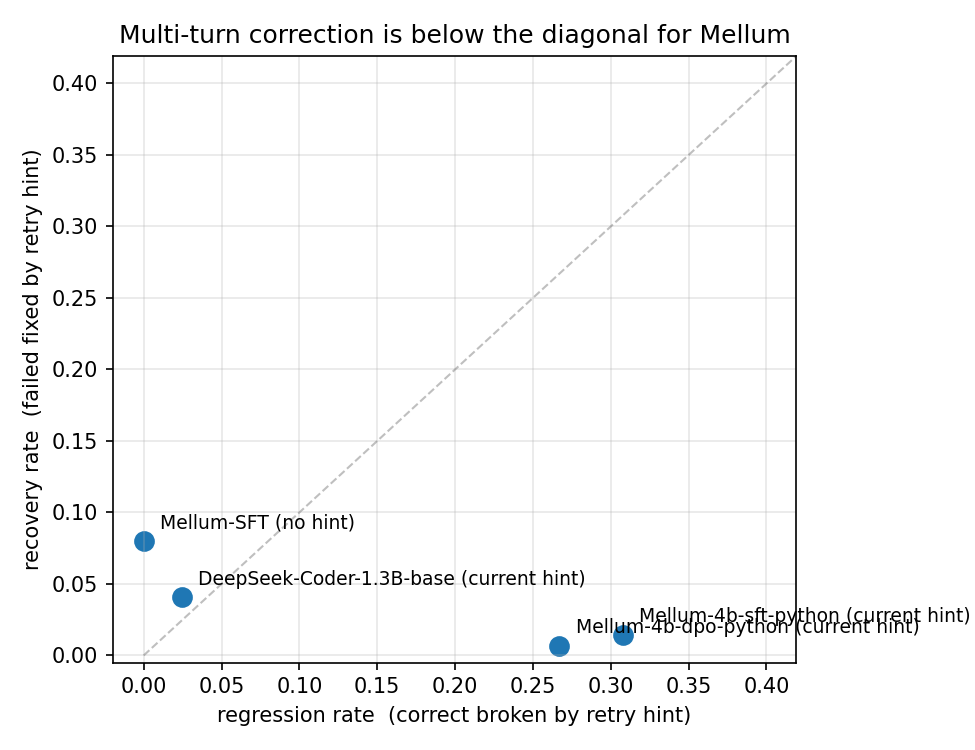

# coding-model-eval

A small probe into whether HumanEval pass@1 actually measures what people quote it for. The benchmark a model is graded on quietly determines what it learns to optimise, so before believing any pass@1 number I want to know how sensitive it is to test rigour, retry shape, and whether the model is being run in the format it was trained on.

I picked Mellum-4b because JetBrains released three variants (base, SFT-on-Python, DPO-on-Python). Same architecture, same pre-training, three post-training stages. Then I added EvalPlus's augmented test suite, a multi-turn retry loop with a no-hint ablation, a regression test that flips the framing on multi-turn, OpenAI's HumanEval-Infilling so Mellum gets scored on what it's actually trained for, and a cross-family check on DeepSeek-Coder-1.3B (base + instruct).

## Headline

Pass@1 with Wilson 95% intervals. n=164 single-turn, 138 retries (Mellum-SFT failures). Regression denominators are model-specific (each model passes a different subset single-turn): 26 for Mellum-SFT, 15 for DPO, 41 for DS-base, 90 for DS-instruct.

| tag | HumanEval | HumanEval+ | + retry (hint) | + retry (no hint) | regression |
|---|---:|---:|---:|---:|---:|
| Mellum-4b-base (completion) | 24.4% [18.5, 31.5] | 21.3% [15.8, 28.2] | - | - | - |
| Mellum-4b-base (FIM tokens) | 23.8% [17.9, 30.8] | 20.7% [15.2, 27.6] | - | - | - |
| Mellum-4b-sft-python | 18.3% [13.1, 24.9] | 15.9% [11.1, 22.2] | 17.1% [12.1, 23.6] | **22.6% [16.7, 29.7]** | 8/26 = 30.8% [16.5, 50.0] |
| Mellum-4b-dpo-python | 11.0% [7.1, 16.7] | 9.1% [5.6, 14.5] | 9.8% [6.1, 15.3] | - | 4/15 = 26.7% [10.9, 52.0] |
| DeepSeek-Coder-1.3B-base | 29.3% [22.8, 36.6] | 25.0% [19.0, 32.1] | 28.0% [21.7, 35.4] | 37.2% [30.2, 44.7] | 1/41 = 2.4% [0.4, 12.6] |
| DeepSeek-Coder-1.3B-instruct | 57.3% [49.7, 64.6] | 54.9% [47.2, 62.3] | 63.4% [55.8, 70.4] | 67.1% [59.6, 73.8] | 4/90 = 4.4% [1.7, 10.9] |

Sandbox-correctness check: I ran the official `evalplus.evaluate` CLI on the Mellum-SFT completions and on the DS-instruct completions in `results/`. Mellum-SFT matches exactly (18.3% / 15.9%). DS-instruct matches on base (57.3%) and disagrees on 2 of 164 plus tests, +1 -1 (54.9% me vs 54.3% theirs). The two diffs are HumanEval/39 (I score plus-pass, EvalPlus scores plus-fail) and HumanEval/92 (the reverse). Both files committed at `results/_evalplus_crosscheck_*.json`. The pass/fail bookkeeping isn't off in any way that would change the headline.

### The benchmark choice does more work than the model choice

JetBrains evaluates Mellum on FIM benchmarks (RepoBench, SAFIM, HumanEval-Infilling), not HumanEval. The HumanEval table above is the wrong axis. I ran the OpenAI HumanEval-Infilling single-line benchmark on the post-trained Mellums and on both DeepSeeks, and added MBPP+ as a third format:

| | HumanEval+ | HumanEval-Infilling | MBPP+ |
|---|---:|---:|---:|
| Mellum-4b-sft-python | 15.9% | 80.8% [78.3, 83.1] (n=1033) | **1.3% [0.6, 3.1]** |
| Mellum-4b-dpo-python | 9.1% | 81.9% [79.4, 84.1] (n=1033) | - |
| DS-Coder-1.3B-base | 25.0% | 16.3% [13.5, 19.6] (n=565, partial) | 22.0% [18.1, 26.4] |
| DS-Coder-1.3B-instruct | 54.9% | 3.7% [2.7, 5.0] (n=1033) | 52.6% [47.6, 57.6] |

Same Mellum-DPO scores 9.1% on HumanEval+ and 81.9% on HumanEval-Infilling: 9x difference on the same model, picked apart by which benchmark you grade with. Post-trained Mellum vs DS-instruct on the same 1033 FIM tasks: 80.8% vs 3.7%, 22x ratio between two 1-4B-parameter families. The benchmark choice is doing more work than the model choice.

Mellum-SFT vs Mellum-DPO on 1033 paired FIM tasks: paired exact McNemar b=33 c=44, p=0.25 (NS). The DPO-over-SFT gain is suggestive but not significant at this n. The HumanEval direction (each post-training stage hurts) is consistent across all three Mellum stages. Mellum-base FIM is missing from the table on purpose: I don't have a clean n=1033 baseline file in this repo for it, so the within-Mellum base-vs-post-trained McNemar stays unfinished. Re-running it is on the "next" list.

On MBPP+ Mellum-SFT scores 1.3%, basically zero, because MBPP+'s prompt format (docstring at the top of an empty file) is out-of-distribution for a FIM-on-Python model. *Caveat:* `eval/mbpp_loader.py` builds my own minimal docstring scaffold, not EvalPlus's canonical MBPP+ prompt. So 1.3% measures the prompt builder as much as the model. The right reading is "format-OOD upper-bound argument", not a tight measurement; a paper-matched prompt would land higher. DS-Coder, trained on more diverse data, handles all three benchmark formats.

### Multi-turn-no-hint generalises to FIM, and works better there

Take the 198 FIM single-line tasks Mellum-SFT failed under greedy completion, run two sampled FIM retries at T=0.6, no hint. Recovery rate **48/198 = 24.2%**. Implied multi-turn FIM pass@1 goes 80.8% -> 85.5% (+4.7 pp).

For comparison, the same policy on HumanEval+ recovers 11/138 = 8.0%. Greedy-then-sample holds on FIM and the relative lift is bigger (3x more often) than on the from-scratch benchmark.

### Compute-matched comparison on Mellum-SFT, budget = 3 generations

| strategy | pass@1 | what it does |
|---|---:|---|
| single-turn greedy | 15.9% | one greedy completion |
| pass@3 sampled at T=0.6 | 18.8% | three independent samples, no retry mechanism |
| multi-turn with hint (3 attempts) | 17.1% | greedy then up to 2 sampled retries with comment-block hint |
| **multi-turn no hint (3 attempts)** | **22.6%** | greedy then up to 2 sampled retries, no hint, just resample |

Sampling beats greedy (+2.9 pp), greedy-anchored sampling beats free sampling (+3.8 pp), and adding the hint to retries claws back 5.5 pp of that gain. Greedy turn 0 captures a high-mass mode that pure sampling at T=0.6 misses.

T=0.6 is the EvalPlus sampling temperature; I picked it from precedent. The repo also has a small calibration on 8 tasks at T in {0.2, 0.6, 1.0} (n=32 per arm: 13/32, 14/32, 11/32). At that sample size T=0.6 isn't statistically distinguishable from T=0.2; it's a tie-broken-by-precedent, not a measured peak.

### The retry hint poisons multi-turn, and the format matters

Four hint formats plus no-hint, same 138 failed tasks (paired):

| format | what it is | recovery |
|---|---|---:|
| post | full block, appended *after* prompt as fake `solution_v1` | 0.0% [0.0, 2.7] |
| current | full block, prepended as comment above function | 1.4% [0.4, 5.1] |
| traceback | one line: `# Failed test: <assertion>` | 4.3% [2.0, 9.2] |
| minimal | one line: `# Previous attempt was wrong. Try again.` | 5.1% [2.5, 10.1] |
| **no hint** | resample only, no prompt change | **8.0% [4.5, 13.7]** |

Paired exact McNemar across the four format-vs-no-hint contrasts, Holm-Bonferroni corrected: post p_holm=0.004, current p_holm=0.035, minimal/traceback NS. So it isn't "hints don't work"; it's that long structured hints that mimic code-comment blocks are significantly worse than no hint after correcting for multiple comparisons, and one-line natural-language hints are about a wash. Replicable from `scripts/analyze_hint_sweep.py`.

The same hint sweep on DS-Coder-1.3B-instruct on its 74 failed tasks: post p_holm=0.017, the rest NS. The verbose code-comment-block placement after the prompt is the only contrast that stays significant on both Mellum-SFT and DS-instruct.

The mechanism is in the per-turn outputs. Final-turn taxonomy across all 138 retried Mellum-SFT tasks:

| format | all-comments | gave-up (`pass`) | wrote real code |
|---|---:|---:|---:|
| post | 36 | 59 | 43 |
| current | 12 | 25 | 101 |
| no hint | 3 | 28 | 107 |

Appending `# def solution_v1: <old code> ... # try again below` *after* the prompt makes the model read the function as already finished and produce empty bodies. HumanEval/41 is the cleanest example: with the current hint, the model's final-turn output is literally `# return 0`, then `# Failed test: assert candidate(0) == 0`, then `# Fix the bug and try again.`, repeated. With no hint on the same task at the same seed, it tries an actual `math.floor` expression. The hint teaches a meta-pattern of commented-out attempt lines, and on retry the model continues that pattern instead of re-entering code.

### Cross-family: regression rate is uniquely large on Mellum

| | recovery (hint) | regression | net change at fixed budget |
|---|---:|---:|---:|
| Mellum-SFT | 1.4% | **30.8%** | hint costs 5.5 pp vs no-hint |
| Mellum-DPO | 0.7% | 26.7% | - |
| DS-Coder-base | 4.1% | 2.4% | hint costs 9.2 pp vs no-hint |
| DS-Coder-instruct | **18.9%** | 4.4% | hint costs 3.7 pp vs no-hint |

Cross-family regression-rate comparisons use Fisher's two-sided exact test (each model's regression denominator is the tasks *that model* passes single-turn). Confirmatory family is the four cross-family Mellum-vs-DeepSeek contrasts, Holm-Bonferroni corrected: Mellum-SFT vs DS-instruct p_holm=0.003, Mellum-SFT vs DS-base p_holm=0.005, Mellum-DPO vs DS-instruct p_holm=0.028, Mellum-DPO vs DS-base p_holm=0.028. All four cross-family contrasts significant after correction. Within-family rates are statistically indistinguishable (Mellum-SFT vs DPO p=1.0; DS-base vs instruct p=1.0).

I had read the original Mellum-only result as "any 1-4B code model will be hint-poisoned." The DeepSeek run rejects that. The right reading: Mellum's SFT-on-Python corpus contains very few examples of comment blocks above functions that look like retry hints, so the model handles them by literal copying. DeepSeek's broader training mixes in enough such patterns that it treats them more like context.



Both with-hint Mellum points sit far below the y=x diagonal: their recovery is dwarfed by their regression rate. DS-base and DS-instruct sit above the diagonal in the lower-left. Mellum-SFT with no hint sits in the upper-left because there's no hint to break correct solutions.

## What "regression rate" actually measures

The regression test fabricates a "previous attempt was wrong" hint on tasks the model already passes and reruns the retry pipeline. What it measures is **false-negative retry sensitivity**: P(correct -> broken | retry triggered). It's not "the cost the average user pays per retry": that's `regression_rate x P(retry-triggered-when-correct)`, and the second factor is deployment-specific (an IDE that auto-retries on every TODO comment is high; a user clicking Retry is low). Even with that caveat, 30.8% on Mellum-SFT is large.

The minimum reportable pair for any "multi-turn helps" claim should be the recovery rate paired with the false-negative retry sensitivity, plus an estimate of how often the deployed retry trigger fires on correct outputs. The published multi-turn pass@1 number reports only the first of those three.

The no-hint regression control (`scripts/run_regression_nohint.py`) narrows the claim: most of what looked like hint-induced damage on the DeepSeek models is just stochastic retry damage on a from-scratch problem (sampled retry breaks 22-33% of correct answers in three of four models even with no hint). On Mellum-SFT the with-hint rate (30.8%) is actually slightly *above* the no-hint control (26.9%), so the hint isn't doing the stabilising work there that it does for DeepSeek. Two confounds I haven't fully addressed: (a) the with-hint regression uses greedy decoding while the no-hint control uses T=0.6 sampled, so this comparison still confounds prompt content with decoding mode; (b) the canonical-poisoning experiment (in `results/`, `*_canonical_poisoning.jsonl`) shows DS-base lifts +32 pp from seeing the canonical, so "hint as anchor" is the more conservative reading than "hint stabilises sampled retries."

## Why does the hint hurt

I don't think this is a "small models can't reason" story. The retries *do* recover problems when the prompt is left alone and the model is just sampled differently; the model knows things, it isn't using them when the comment block is in the prompt.

My read: Mellum is trained on raw Python files. The retry hint format is a comment block above the function that mentions the previous attempt and the failing assertion. The model treats that as code it should honor, not as instructions to ignore. So on retry it tries to literally produce the commented-out attempt or to patch around the literal assertion. The per-turn outputs show exactly this: lots of commented-out previous attempts copied forward, and `pass`-only bodies.

## What's in here

```
eval/sandbox.py     subprocess + 10s timeout. -I on the interpreter
                    because /tmp/inspect.py once ate two hours.
eval/loaders.py     joins openai/openai_humaneval and evalplus/humanevalplus
                    so one completion is scored under both test suites.
eval/runner.py      completion + FIM (Mellum / DeepSeek tokens), four
                    retry-hint formats, sentinel-round-trip tokenizer
                    fallback for the DeepSeek-Coder whitespace bug.
eval/multi_turn.py  retry loop with use_hint + hint_format selector.
eval/{fim,mbpp}_loaders.py    HumanEval-Infilling and MBPP+ adapters.
eval/report.py      Wilson CIs, codex-style pass@k, cross-table.
scripts/run_*.py    one runner per experiment.
scripts/analyze_hint_sweep.py  exact paired McNemar + Holm-Bonferroni.
scripts/summary.py             one-command audit of every README claim.
modal_runner.py     Modal entrypoints (local 4090 went down mid-project).
results/            JSONL per (tag, experiment), one row per task.
```

About 1300 lines of Python excluding smoke and inspection helpers.

## Things that didn't work

- First multi-turn run produced byte-identical output on every retry. Greedy decoding plus a small comment-prefixed prompt rarely flips the argmax. Switched to T=0.6 with a per-task seed for retries only. Turn 0 stays greedy so the single-turn number matches what a leaderboard would post.
- Halfway through, every plus test started failing with `AttributeError: module 'inspect' has no attribute 'cleandoc'`. Took half a day to find. Full writeup in [`post-mortem.md`](./post-mortem.md). Short version: I'd dropped a `/tmp/inspect.py` while debugging, Python prepends a subprocess script's directory to `sys.path`, my five-line shadow file beat stdlib `inspect`, numpy then fails to import. `python -I` fixes it.
- Expected Mellum-SFT to outperform Mellum-base on HumanEval. The opposite ordering (base > SFT > DPO) is the writeup.
- Expected the retry hint to help recovery. The opposite is true on Mellum (and the "post" format is catastrophic, 0/138 recoveries). On DeepSeek-Coder-base the hint helps, +3 pp.
- DeepSeek-Coder's tokenizer dropped whitespace from BPE encodings on round-trip: `def add(a, b)` round-tripped to `defadd(a,b)`. First DeepSeek-base run produced 0/164 because the model was being shown text without spaces. Fix in `eval/runner.py`: round-trip a sentinel and fall back to `tokenizers.Tokenizer.from_file` if the round-trip is lossy.

## What I'd do next

- **FIM-aware test mutation.** EvalPlus's mutation strategy doesn't transfer to FIM benchmarks. Mutate the *surrounding file context* AST-level (rename variables, reorder imports, add an unrelated function above) and re-evaluate against SAFIM or RepoBench.
- **Five-format sweep on stronger models.** No-hint wins for every model in this set, but the gap shrinks with capability (5.5 pp on Mellum-SFT, 3.7 pp on DS-instruct). Worth running the same paired-McNemar five-format sweep on Qwen2.5-Coder-Instruct and StarCoder2-7B to find out whether the gap closes or flips signs.
- **Calibrate the regression-rate trigger.** Regression rate is `P(correct -> broken | retry triggered)`. The deployed cost is that times `P(retry triggered | correct)`, which is deployment-specific. Instrument an IDE retry trigger on a Mellum deployment and measure the conditional probability in the wild.
- **Re-run Mellum-base FIM at full n=1033** so the post-training story has a clean three-stage McNemar grid, and re-run DS-base FIM to completion past its current 565-row partial.

## Reproducing

```bash
uv sync
# Mellum-SFT primary battery (substitute $M for the model directory)
PYTHONPATH=. uv run python scripts/run_singleturn.py        $M/mellum-sft-python mellum_sft   # ~13 min
PYTHONPATH=. uv run python scripts/run_multiturn.py         $M/mellum-sft-python mellum_sft   # ~45 min
PYTHONPATH=. uv run python scripts/run_multiturn_nohint.py  $M/mellum-sft-python mellum_sft   # ~30 min
PYTHONPATH=. uv run python scripts/run_regression.py        $M/mellum-sft-python mellum_sft   # ~5 min
PYTHONPATH=. uv run python scripts/run_passk.py             $M/mellum-sft-python mellum_sft   # ~50 min, 4 samples T=0.6
PYTHONPATH=. uv run python scripts/run_hint_sweep.py        $M/mellum-sft-python mellum_sft   # ~90 min, 3 formats
PYTHONPATH=. uv run python -m eval.report
PYTHONPATH=. uv run python scripts/analyze_hint_sweep.py
PYTHONPATH=. uv run python scripts/summary.py
PYTHONPATH=. uv run python scripts/make_plot.py
```

GPU runs were on a 4090 (24GB) and on Modal A10Gs once the local box went offline. The torch index in `pyproject.toml` is pinned to the cu128 channel so the lockfile resolves on a fresh CUDA box. To run on Apple silicon, drop the `[tool.uv.sources]` block and let uv resolve a CPU build. Modal entries are at the top of `modal_runner.py`.

## Things this is not

A small probe, not a benchmark. Two model families, one benchmark family, one decoding configuration. The conclusions worth defending from this much data are "the way pass@1 with retries is reported needs more components than it currently has", "Mellum's HumanEval scores under-represent the model in two specific ways", and "the regression rate effect is uniquely large on Mellum-SFT, not generic to small code-completion models."

## References

- Liu, Xia, Wang, Zhang. *Is Your Code Generated by ChatGPT Really Correct? Rigorous Evaluation of Large Language Models for Code Generation.* NeurIPS 2023. [arXiv:2305.01210](https://arxiv.org/abs/2305.01210). The EvalPlus paper.
- JetBrains Research. Mellum weights and the SFT/DPO variants are at [HuggingFace](https://huggingface.co/JetBrains).
- Guo et al. *DeepSeek-Coder: When the Large Language Model Meets Programming -- The Rise of Code Intelligence.* [arXiv:2401.14196](https://arxiv.org/abs/2401.14196).
- Chen et al. *Evaluating Large Language Models Trained on Code.* The Codex paper; the unbiased pass@k estimator I use comes from here. [arXiv:2107.03374](https://arxiv.org/abs/2107.03374).
- Bavarian et al. *Efficient Training of Language Models to Fill in the Middle.* [arXiv:2207.14255](https://arxiv.org/abs/2207.14255). The OpenAI HumanEval-Infilling benchmark used in the FIM table.
